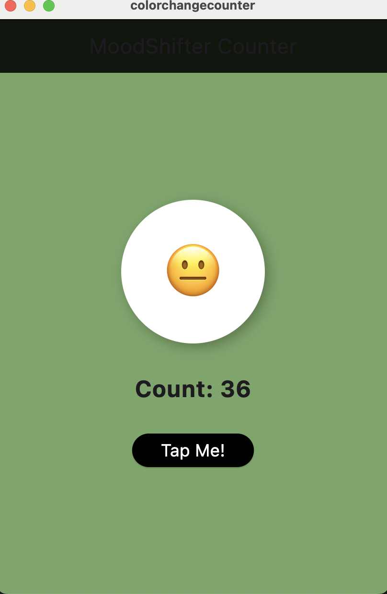
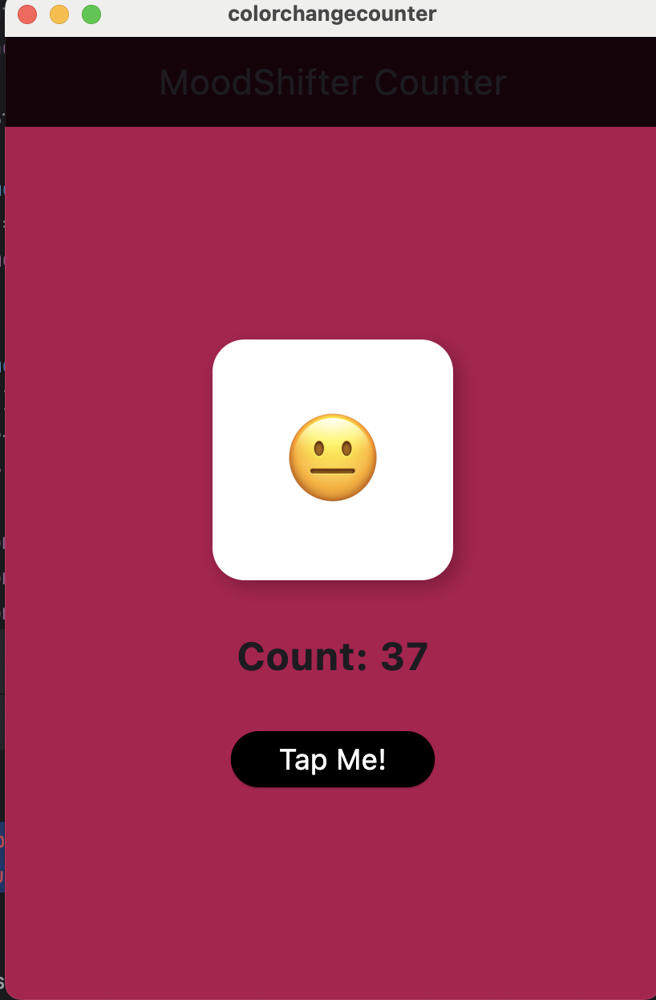
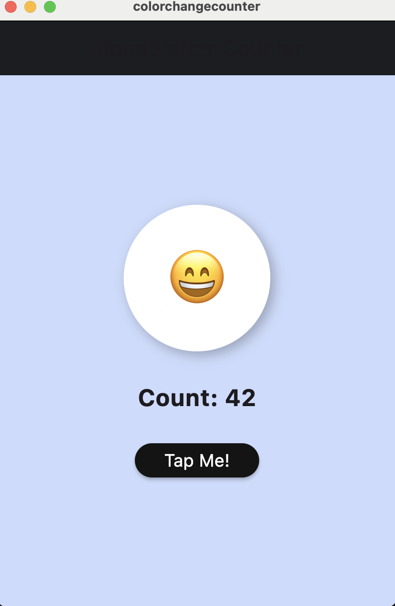

---

````markdown
# 🎉 MoodShifter Counter

A fun and interactive Flutter app that demonstrates creative use of the `setState()` method.  
Each button tap changes multiple aspects of the UI dynamically — including the background color, emoji mood, and shape!

---

## 📱 Features

- 🔢 **Interactive Counter**: Tap a button to increase the counter.
- 🎨 **Random Background Color**: Each tap changes the background to a random color.
- 😄 **Emoji Mood Switcher**: Emoji changes based on the counter value to reflect different moods.
- 🔲 **Shape Shifter**: Shape toggles between circle, rounded box, and square every time.
- 🎯 **Smooth Animations**: `AnimatedContainer` provides smooth visual transitions.

---

## 🚀 Getting Started

### Installation

1. **Clone this repository:**

```bash
git clone https://github.com/your-username/moodshifter_counter.git
cd moodshifter_counter
````


## 🧠 Concepts Covered

* `StatefulWidget` and `setState()` usage
* Random color generation
* Dynamic UI updates based on state
* Using `AnimatedContainer` for animated transitions
* Simple emoji logic based on counter value
* Layout widgets like `Column`, `Center`, and `ElevatedButton`

---

## 📸 Screenshots

> *(Add screenshots of your app UI here)*




---


